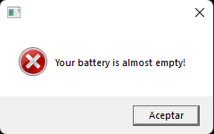
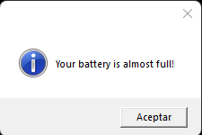
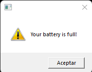

# BatteryAlert

**Description**:  
When a device battery is fully charged and continue charging for a long time more, the battery can get damaged. Unfortunately, Windows does not provide a way to detect this situation, it just show a notification when it's low not when it's full.
So, this program can detect this situation and show a notification.

Other things to include:

  - **Technology stack**: It was made in VBScript, so you don't need to install any software but this one.

## Installation

You can run it by double clicking the file, but thus it will just work once. In order to run it every time you start your computer, you should do the following:
- Download the BatteryAlert.vbs file to your computer
- Press Windows+R, then type `shell:startup`, then click OK or press enter

A File Explorer window will appear, that's the "Startup Folder", that's where the program files that run at startup are.

- Copy the BatteryAlert.vbs file to the Startup Folder
- Restart your computer

The program will run every time you start your computer.

## Usage

**Screenshots**

When Battery is low the following notification will appear:

When Battery almost full the following notification will appear:

When Battery is fully charged the following notification will appear:

The program will check the Battery every some minutes, but between the checks it will be in a sleep mode so it won't consume any resources.

## License
BatteryAlert is released under the [MIT license](https://opensource.org/licenses/MIT).
